# Projektni zadatak 1

##  Zadatak 1):

U ovom delu zadatka napisane su funkcije **calculateShelvingCoeff** i
**calculatePeekCoeff** koje računaju koeficijente all-pass filtera
prvog, odnosno drugog reda, po sledećim formulama:

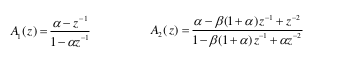

**Slika 1** – Formule za izračunavanje koeficijenata

Kako se koeficijenti A1 i B1 nalaze na opsegu \[-2, 2), na njihivim
položajima čuvaće se polovina njihove vrednosti, tako da će raspored u
memoriji izgledati ovako:

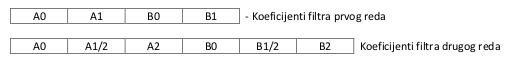

**Slika 2** – Izgled koeficijenata u nizu

## Zadatak 2):

Za potrebe ovog zadatka napisana je funkcija **shelvingLP**, koja za
računanje koristi **first\_order\_iir**. Impulsni odzivi na filter sa
karakteristikom **α = 0.3**, sa koeficijentima **K= 8192** (0.25) i **K
= 24576** (0.75) dat je na grafiku ispod.

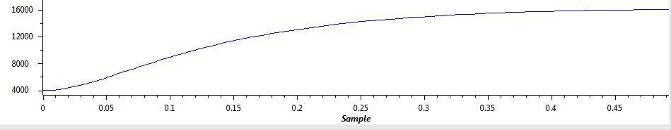

**Slika 3** – Impulsni odziv, **shelvingLP** (α = 0.3, K= 8192)

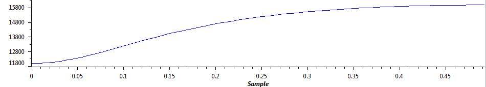

**Slika 4** – Impulsni odziv, **shelvingLP** (α = 0.3, K= 24576)

## Zadatak 3):

Za potrebe ovog zadatka napisana je funkcija **shelvingHP**, koja za
računanje koristi **first\_order\_iir**. Impulsni odzivi na filter sa
karakteristikom **α = -0.3**, sa koeficijentima **K= 8192** (0.25) i **K
= 24576** (0.75) dat je na grafiku ispod.

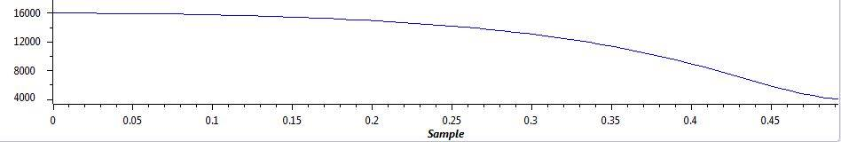

**Slika 5** – Impulsni odziv, **shelvingHP** (α = -0.3, K= 8192)

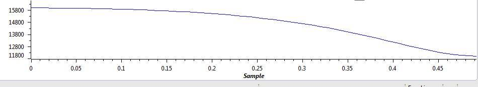

**Slika 6** – Impulsni odziv, **shelvingHP** (α = -0.3, K= 24576)

## Zadatak 4):

Za potrebe ovog zadatka napisana je funkcija **shelvingPeek**, koja za
računanje koristi **second\_order\_iir**. Impulsni odzivi na filter sa
karakteristikom **α = 0.7**, **β = 0**, sa koeficijentima **K= 8192**
(0.25) i **K = 24576** (0.75) dat je na grafiku ispod.

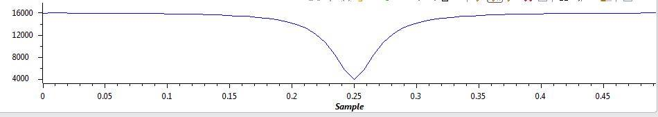{width="6.502083333333333in"
height="1.0583333333333333in"}

**Slika 7** – Impulsni odziv, **shelvingPeek** (α = 0.7, β = 0, K= 8192)

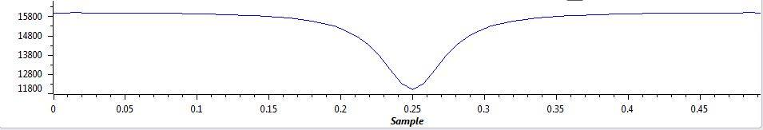

**Slika 8** – Impulsni odziv, **shelvingPeek** (α = 0.7, β = 0, K= 24576)

**Zadatak 5):**
---------------

Ovaj zadatak predstavlja proširenje i uniju prethodna 4 zadatka. Pre
obrade signala računaju se koeficijenti α i β za svaki od delova
ekvilajzera, izračunati tako da odgovaraju frekvencijama koje su date u
tabeli.

  Band 0 fC  | Band 1 f0 | Band 1 Δf | Band 2 f0 | Band 2 Δf | Band 3 fC
  -------------|-------------|-----------|-------------|-----------|-------------
  140 Hz       |390 Hz       |200 Hz     |2935 Hz      |1905 Hz    |5500 Hz

**Tabela 1** – Vrednosti frekvencija

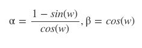

**Slika 9** – Formula za izračunavanje koeficijenata α i β

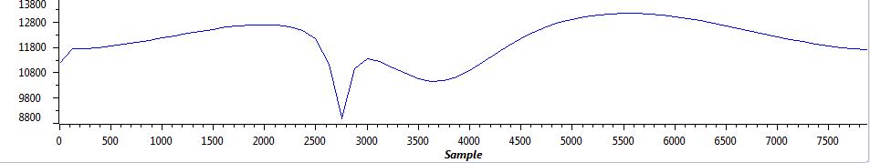

**Slika 10 –** Izlaz sistema na impulsni odziv

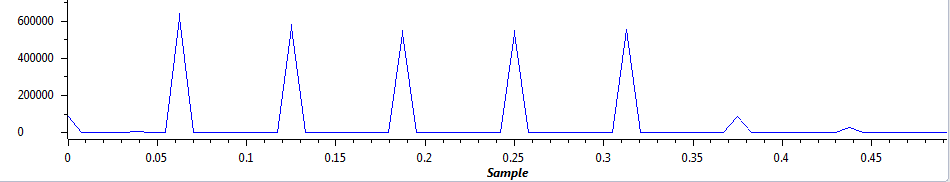

**Slika 11 –** Ulazni signal u dati sistem
(multiton)

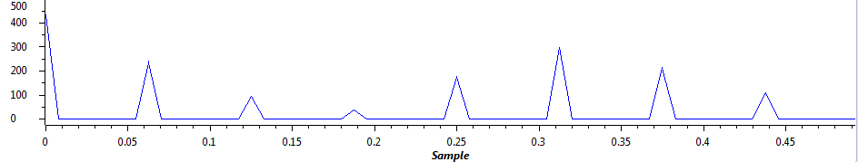

**Slika 12** – Izaz sistema na multiton signal za različite vrednosti parametara k u sve 4 faze

**Zadatak 6):**
---------------

Za potrebe ovog zadatka uveden je niz koeficijenata k, koji sadrži 4
elementa. Svaki od elemenata predstavlja k za jednu od 4 faze iz
prethodnog zadatka. Vrednost ovih koeficijenata može da se menja
pritiskom na tastere **SW1** i **SW2**, za čije potrebe je napisana
funkcija **getKey**. Trenutno stanje ispisuje se nakon svake promene na
displej. Prvi karakter predstavlja indeks broja k
koji se trenutno prikazuje i menja (0-3), a drugi predstavlja vrednost
selektiranog k. k može uzeti vrednost između 0.1 i 1.0, koje odgovaraju
vrednostima od 3277 do 32767. Za potrebe ispisa dodata su 2 karaktera u
tabelu (`" "` i `"."`) i realizovana je funkcija **printNewValue**, koja
ispisuje nove vrednosti nakon svake promene.
