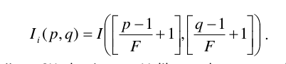
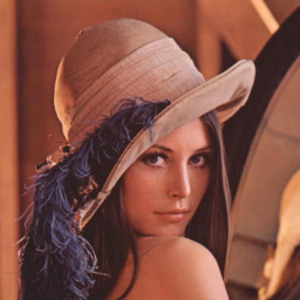
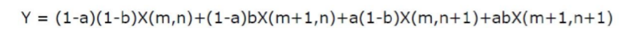
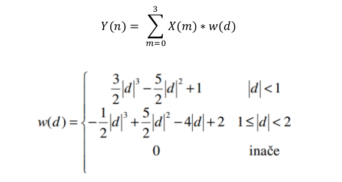
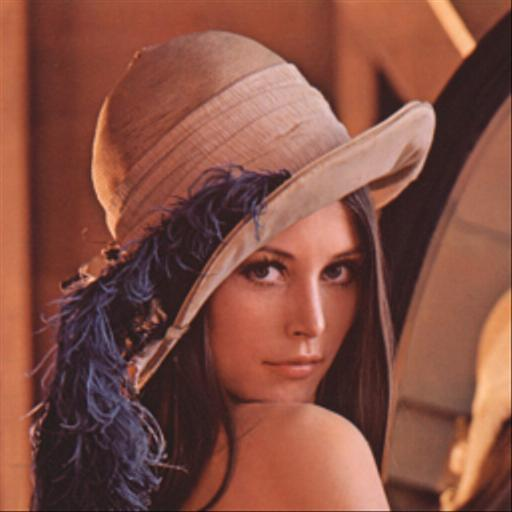
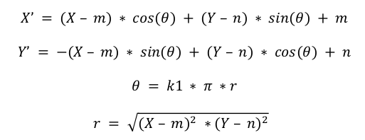
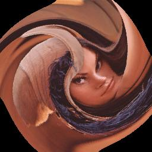

# Projektni zadatak 2

## Zadatak 1):

U ovom delu zadatka napisana je funkicija **sampleAndHold** koja vrši interpolaciju slike **Sample and hold** algoritmom.

**Slika 1** – Formula **Sample and hold** algoritma

> 
> 

**Slika 2** – Rezultat **sample and hold** interpolacije za parametre 2, 2

## Zadatak 2):

U ovom delu zadatka napisana je funkicija **bilinearInterpolate** koja vrši interpolaciju slike koja vrši bilinearnu interpolaciju slike algoritmom.

**Slika 3** – Formula za bilinearnu interpolaciju

> 
> 

**Slika 4** – Rezultat **bilinearne** interpolacije za paramtre 2, 2

## Zadatak 3):

U ovom delu zadatka napisana je funkicija **bicubicInterpolate** koja vrši interpolaciju slike koja vrši bikubičnu interpolaciju slike.

**Slika 5** – Formula **bikubične** interpolacije

> 
> 

**Slika 6** – Rezultati **bikubične** interpolacije za parametre 2, 2

## Zadatak 4):

U ovom delu zadatka napisana je funkicija **imageSwirl** koja vrši **Swirl** transformaciju slike, za parametar **k**, po sledećoj formuli.

**Slika 7** – Formula **Swirl** algoritma

> 
> 

**Slika 8** – Rezultat **Swirl** algoritma za parametar 0.005

## Zadatak 5):

U ovom delu zadatka napisana je funkicija **imageSwirlBilinear** koja vrši **Swirl** transformaciju slike, za parametar **k**, međutim koristi bilinearnu formulu za računanje vrednosti piksela.

> 
> 

**Slika 9** – Rezultat **SwirlBilinear** algoritma za parametar 0.005

## Bonus:

Nakon urađene **Swirl** transformacije za 0.005 urađena je **Swirl** transformacija za -0.005. Zbog ograničenja u veličini slike jedan deo slike izgubljen je nakon rekonstrukcije. Rezultati nakon rekonstrukcije za **Swirl** i **SwirlBilinear** dati su ispod.

> 
> 

**Slika 10** – Originalna slika (levo) i slika nakon primene **Swirl** transformacije za parametar 0.005 (desno)

> 
> 

**Slika 11** – Slika nakon rekonstrukcije **Swirl** algoritom (levo) I
**SwirlBilinear** algoritmom (desno) za parametar -0.005
